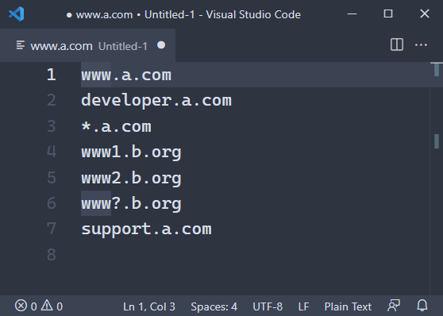

# Reduce Wildcard Patterns

Visual Studio Code extension to reduce wildcard pattern lines.

## Usage

1.  Select lines.
    If no line is selected, the entire text is taken.
2.  Press Ctrl+Shift+P or F1 to show *Command Palett*.
3.  Execute **Reduce Wildcard Pattenrs**.

## Features

Compare each row and reduce the number of rows by wildcard matching.

- A star `*` matches any string, including empty string.
- A question mark `?` matches any single character.
- A star takes precedence over a question mark.
  - The program does not determine the precedence between `x*y?z` and `x?y*z`.
    However, you can make `x*y*z` by your hand in this case.
- Consecutive starts are compressed into one.
- `[characters]`, `[!characters]`, and `[^characters]` are not supported.
  Brackets are treated as literal characters.
